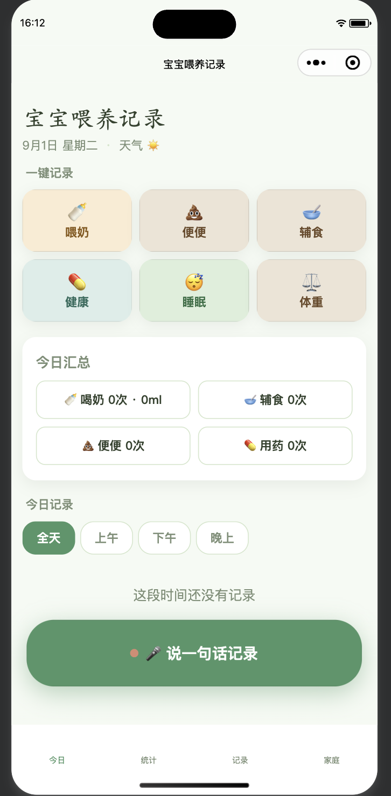

# 满宝喂养记录（微信小程序 · 云开发）

一款面向家庭的宝宝喂养记录微信小程序，主打**老人易用**：一键快速记录 + 语音/文字自然语言输入，全家通过「家庭码」共享同一份数据。前端使用微信小程序原生开发，后端基于微信云开发（云函数 + 云数据库），无自建服务器。

<div align="center">
  
  <span>&nbsp;&nbsp;&nbsp;&nbsp;</span>
  
</div>

## 功能特性

- **喂养记录**：喝奶（母乳 / 混合 / 奶粉 + 奶量）、辅食、用药、便便、睡眠、疫苗、生病，覆盖日常记录场景
- **语音 / 文字输入**：语音识别（腾讯云 ASR）+ 自然语言解析（DeepSeek），解析出结构化记录后**确认再保存**，不自动写入
- **家庭共享**：创建 / 加入 6 位家庭码，家人共享同一份喂养数据
- **数据查看**：今日汇总、按天浏览历史、近 7 天 / 30 天统计
- **编辑与导出**：记录可编辑 / 删除，支持一键导出近 7 天记录到剪贴板

## 页面结构

| 页面路径 | 说明 | 类型 |
|---|---|---|
| `pages/today/index` | 今日（首页） | tabBar |
| `pages/stats/index` | 统计 | tabBar |
| `pages/records/index` | 记录（历史） | tabBar |
| `pages/me/index` | 家庭 | tabBar |
| `pages/entry-milk/index` | 记录喝奶 | 普通页 |
| `pages/entry-solid/index` | 记录辅食 | 普通页 |
| `pages/entry-med/index` | 记录用药 | 普通页 |
| `pages/entry-poop/index` | 记录便便 | 普通页 |
| `pages/entry-sleep/index` | 记录睡眠 | 普通页 |
| `pages/entry-vaccine/index` | 记录疫苗 | 普通页 |
| `pages/entry-illness/index` | 记录生病 | 普通页 |
| `pages/voice/index` | 语音 / 文字输入 | 普通页 |

## 目录结构

```
baby_feed_miniapp/
├── miniprogram/          # 小程序前端
│   ├── app.json          # 页面 + tabBar 配置
│   ├── app.js            # 云开发初始化
│   ├── env.js            # 云环境 ID
│   ├── pages/            # 12 个页面
│   ├── services/api.js   # 所有 wx.cloud.callFunction 调用
│   └── utils/            # 日期、常量工具
├── cloudfunctions/       # 云函数（每个函数独立部署）
├── HomePage.png          # 首页截图
├── 满宝喂养记录小程序码.png  # 小程序码
└── project.config.json   # 开发者工具项目配置
```

## 快速开始

### 本地运行

1. 安装[微信开发者工具](https://developers.weixin.qq.com/miniprogram/dev/devtools/download.html)
2. 导入项目目录 `baby_feed_miniapp`（`project.config.json` 已配置好 `miniprogramRoot` 与 `cloudfunctionRoot`）
3. 在开发者工具中开通云开发，并将环境 ID 填入 `miniprogram/env.js` 的 `CLOUD_ENV_ID`
4. 在「云开发 / 云函数」中，对每个函数右键「上传并部署：云端安装依赖」

> 若提示 `Environment not found`，请确认 `miniprogram/env.js` 中的 `CLOUD_ENV_ID` 与你的云开发环境 ID 一致。

### 数据库集合

在云开发控制台手动创建以下集合（若未自动生成）：

- `families` — 家庭（含家庭码）
- `family_members` — 家庭成员（openid ↔ familyId）
- `events` — 喂养记录

### 环境变量（可选功能）

在「云开发控制台 → 环境 → 环境变量」中配置（**不要把 Key 写进代码或提交到仓库**）：

| 变量名 | 用途 | 关联云函数 |
|---|---|---|
| `DEEPSEEK_API_KEY` | 自然语言解析（文字输入） | `nlp_parse` |
| `TENCENT_SECRET_ID` | 腾讯云语音识别 | `speech_recognize` |
| `TENCENT_SECRET_KEY` | 腾讯云语音识别 | `speech_recognize` |

不配置上述变量时，文字输入会回退到本地正则解析，语音功能不可用，其余功能不受影响。

## 云函数清单

| 云函数 | 说明 |
|---|---|
| `family_create` | 创建家庭（含唯一家庭码） |
| `family_join` | 按家庭码加入家庭 |
| `family_get` | 获取当前家庭信息（家庭码、成员数） |
| `event_add` | 新增记录 |
| `event_update` | 编辑记录 |
| `event_list_by_date` | 按天列出记录 |
| `event_delete` | 删除单条记录 |
| `event_clear_all` | 清空家庭下全部记录 |
| `summary_daily` | 当日汇总 |
| `stats_range` | 近 N 天统计 |
| `nlp_parse` | 文字自然语言解析（DeepSeek） |
| `speech_recognize` | 语音识别（腾讯云 ASR） |

## 技术栈

| 模块 | 选型 |
|---|---|
| 前端 | 微信小程序原生（WXML / WXSS / JS） |
| 后端 / 数据 | 微信云开发（云函数 + 云数据库） |
| 语音识别 | 腾讯云 ASR（经云函数中转） |
| 自然语言解析 | DeepSeek API（经云函数中转） |

## 使用说明

- **今日**：一键记录（喝奶 / 辅食 / 用药 / 便便 / 睡眠 / 疫苗 / 生病）+ 当日汇总 + 最近记录 + 时间筛选 + 悬浮语音按钮
- **记录**：按天浏览当天记录与汇总，支持编辑 / 删除
- **统计**：今天 / 近 7 天 / 近 30 天
- **家庭**：创建 / 加入家庭码、复制家庭码、导出近 7 天数据
